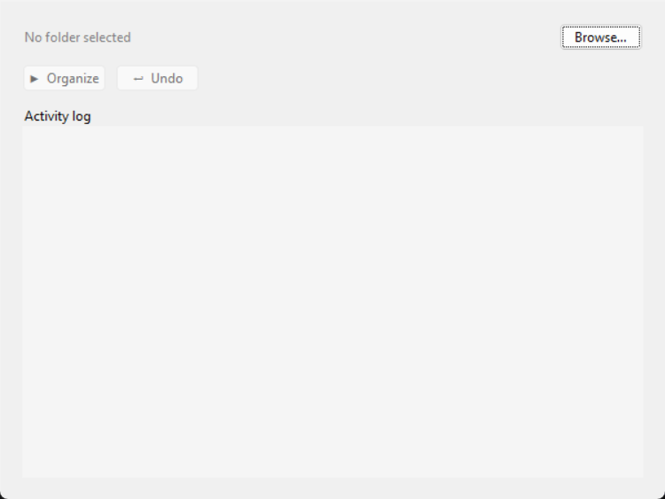

# Smart File Organizer

A simple desktop app that automatically sorts files in a folder into subfolders based on their extension (Images, Documents, Videos, Audio, Code, Archives, Other).

## Features
- Scan a folder and classify files by extension
- Move files into categorized subfolders automatically
- Undo the last organize operation
- Activity log with timestamps (GUI + log file)
- Error handling for permission issues, missing files, and naming conflicts

## Architecture (MVC)

```

smart_file_organizer/

├── main.py                     # Entry point
├── model/
│   ├── file_item.py            # FileItem dataclass
│   ├── classifier.py           # FileClassifier - extension → category
│   └── organizer.py            # FileOrganizer - scan, organize, undo
├── view/
│   └── app_view.py             # Tkinter GUI
├── controller/
│   └── app_controller.py       # Bridges View and Model
├── utils/
│   └── logger.py                # AppLogger - logs/organizer.log
└── tests/
└── test_classifier.py      # Unit tests for classification

```

## Requirements
Python 3.10+ (standard library only - no external packages needed).

## How to run

```bash
git clone https://github.com/TOMMMMMMMMMMMMP/Smart-File-Organizer.git
cd Smart-File-Organizer
python main.py
```

## How to use
1. Click **Browse…** and select a folder to organize.
2. Click **▶ Organize** - files get sorted into subfolders by type.
3. Click **↩ Undo** to reverse the last operation.
4. Check `logs/organizer.log` for a full history of moves.

## Screenshot



## Running tests

```bash
python tests/test_classifier.py
```
